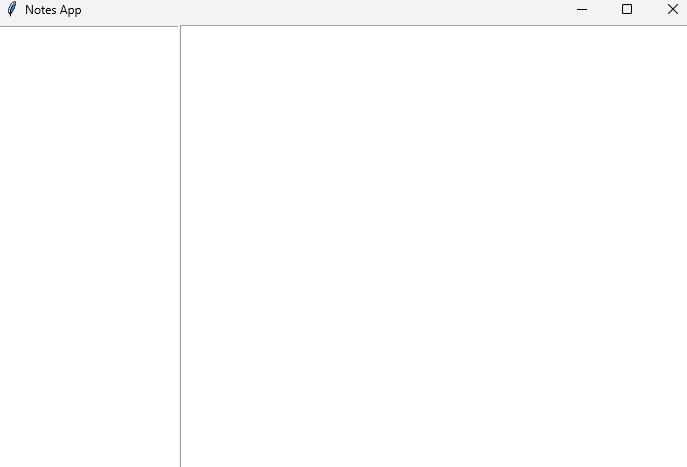

# 📝 Notes App (Python + Tkinter)

A simple and lightweight **Notes Application built with Python and Tkinter**.  
This desktop app lets you **create, view, and delete notes** with a clean graphical user interface.  
All notes are saved locally in **JSON** for persistence, making it a beginner-friendly project to practice **Python GUI development, file handling, and desktop applications**.  

---

## 🚀 Features
- ✍️ Create new notes with title and content  
- 📖 View saved notes from a list  
- 🗑️ Delete notes easily  
- 💾 Notes stored locally in `notes.json`  
- 🎨 Clean and lightweight GUI  

---

## 📸 Screenshots

### Notes App UI

